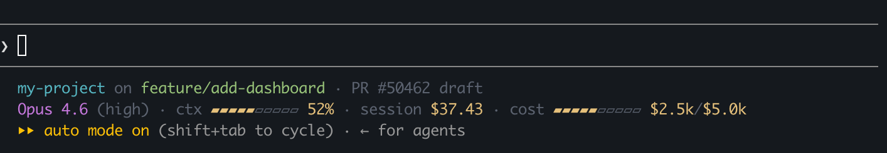

# Yet Another Claude Code Statusline

Custom statusline for Claude Code CLI that shows account spending limits, session cost, context usage, model info, and git status.



## How it works

**Line 1:** project name, git branch, PR status — from Claude Code stdin + `gh` CLI. PR number is a clickable link to GitHub (uses OSC 8 terminal hyperlinks, works in iTerm2, Kitty, Wezterm, etc.).

**Line 2:** model, effort, context bar, session cost, account spending bar — context and session cost come from Claude Code stdin. Account spending is fetched from the Anthropic OAuth API (`api.anthropic.com/api/oauth/usage`) using credentials stored in macOS Keychain (or `~/.claude/.credentials.json` on Linux). This is the tricky part — the endpoint is undocumented, and getting the auth token right took some digging.

Bars turn green, amber, or red as usage increases. If spending data isn't available yet, you'll see an empty bar with `-/-`.

## Prerequisites

- `jq`, `git`, `gh`, `curl`
- macOS or Linux

## Install

1. Backup your settings (if you have a custom statusline already):
```sh
cp ~/.claude/settings.json ~/.claude/settings.json.bak
```

2. Copy the script:
```sh
cp statusline.sh ~/.claude/statusline.sh
```

3. Add to `~/.claude/settings.json`:
```json
{
  "statusLine": {
    "type": "command",
    "command": "sh ~/.claude/statusline.sh",
    "padding": 0
  }
}
```

4. Restart Claude Code.
